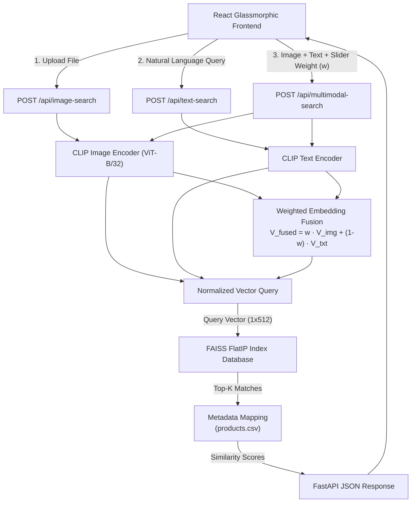
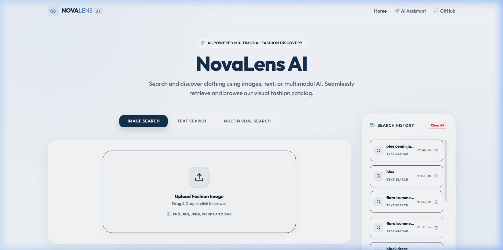
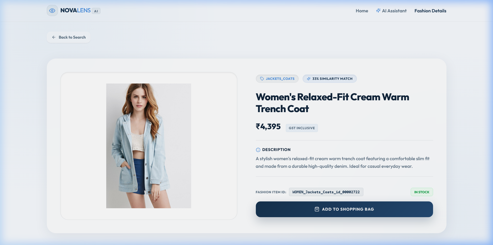
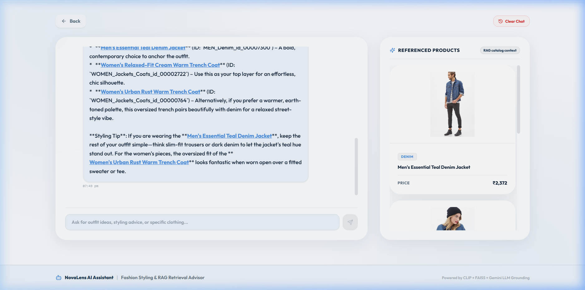

<h1 align="center" style="background-color: #16324F; color: #FFFFFF; font-weight: bold; padding: 25px; border-radius: 16px;">NovaLens AI: Multimodal Fashion Discovery Platform</h1>

NovaLens AI is a modern, premium, multimodal fashion discovery platform. The project is fully completed and operational, enabling customers to discover clothing via visual similarities, semantic natural language, or a hybrid combination of both. It leverages state-of-the-art vector embeddings, similarity search indices, and a personalized recommendation engine to provide a state-of-the-art catalog retrieval experience.

---

<h2 style="font-weight: bold;">1. Project Overview & Features</h2>

NovaLens AI is fully completed with all its core capabilities active:

- <b>Home / Landing Workspace</b>: A sleek, glassmorphic dashboard showcasing the search mode controls, recent search history sidebar, and recommendation modules.
- <b>Visual Similarity Search (Phase 1)</b>: Drag-and-drop or upload custom catalog reference images to perform instantaneous visual searches. Features automatic feature extraction using CLIP.
- <b>Semantic Text Search (Phase 2)</b>: Query the clothing catalog using complex natural language (e.g., `"blue denim jacket"`, `"floral summer dress"`) leveraging CLIP's aligned text-to-image vector space.
- <b>Multimodal Search (Phase 3)</b>: Mix visual input with text modifiers (e.g., upload a blue shirt, type `"similar but black color"`) and control their influence using an interactive weight slider.
- <b>Query Explainability</b>: A real-time mathematical fusion breakdown panel detailing weights, vector scaling, and relative input influence during multimodal queries.
- <b>AI Fashion Assistant (RAG)</b>: An interactive conversational fashion styling advisor. Users can ask for outfit ideas, college outfits, or styling tips. The assistant uses catalog context retrieval to display referenced product cards directly in the chat sidebar.
- <b>Product Details & Recommendations</b>: Dedicated detail views displaying catalog parameters, prices, and high-resolution product imagery, paired with a personalized recommendations carousel based on recently viewed items.
- <b>Compare Online (AI Shopping Intelligence)</b>: Real-time price and offer comparison across whitelisted trusted online retailers (e.g. Myntra, Ajio, Amazon, Flipkart, Tata Cliq). Deals are evaluated using a multi-factor Shopping Score (rating, review count, price, trust) to recommend the <i>Best Price (Budget Pick)</i>, <i>Best Quality (Top Rated)</i>, and <i>Best Overall Value (Smart Pick)</i>, along with a structured AI buying analysis summary.
- <b>Local Search History</b>: Stays persisted in browser local storage, caching the latest 10 query states (including base64 visual backups) to easily restore inputs and reload results.

---

<h2 style="font-weight: bold;">2. Architecture Diagram</h2>



---

<h2 style="font-weight: bold;">3. Technology Stack</h2>

- <b>Frontend</b>: React (Vite), TailwindCSS, Framer Motion, Axios, Lucide Icons
- <b>Backend</b>: FastAPI (Python), Uvicorn ASGI Server
- <b>ML Embeddings</b>: OpenAI CLIP (`ViT-B/32` model)
- <b>Vector Index</b>: FAISS (Facebook AI Similarity Search - IndexFlatIP)
- <b>Data Processing</b>: Pandas, NumPy, Pillow (PIL)

---

<h2 style="font-weight: bold;">4. UI Demonstrations & Screenshots</h2>

<h3 style="font-weight: bold;">A. Home / Landing Workspace</h3>
<i>The default workspace highlighting the platform layout, search controls, search history sidebar, and recommendation modules:</i>


<h3 style="font-weight: bold;">B. Image Similarity Search</h3>
<i>Drag-and-drop a visual catalog reference to fetch matching silhouettes and cuts:</i>


<h3 style="font-weight: bold;">C. Semantic Text Search</h3>
<i>Leverage natural language semantics instead of standard keyword matching:</i>


<h3 style="font-weight: bold;">D. Multimodal Search & Explainability</h3>
<i>Fuses a visual target with written instructions, accompanied by the Query Explanation mathematical breakdown:</i>


<h3 style="font-weight: bold;">E. Product Details & Compare Online</h3>
<i>Inspect product metadata, descriptions, and pricing, complete outfits with the AI fashion stylist, or scan/compare online offers across whitelisted retailers using the AI Shopping Intelligence Engine:</i>


<h3 style="font-weight: bold;">F. AI Fashion Assistant & RAG Catalog Grounding</h3>
<i>Consult the conversational fashion advisor for complete styling ideas. Relevant catalog products are retrieved and cited inside the referenced items sidebar:</i>


---

<h2 style="font-weight: bold;">5. Installation & Setup Guide</h2>

<h3 style="font-weight: bold;">Step 1: Clone & Install Dependencies</h3>
1. **Clone the repository** and navigate to the root directory.
2. **Install Python backend requirements**:
   ```bash
   pip install -r requirements.txt
   ```
   <i>(This installs PyTorch, torchvision, fastapi, uvicorn, faiss, and the CLIP wheel).</i>
3. **Install React frontend requirements**:
   ```bash
   cd frontend
   npm install
   cd ..
   ```

<h3 style="font-weight: bold;">Step 2: Dataset Preparation</h3>
Ensure the DeepFashion In-Shop Clothes Retrieval dataset is downloaded and extracted inside `data/DeepFashion/`.
1. Run the metadata compatibility generation script:
   ```bash
   python data/generate_metadata.py
   ```
   <i>(This scans the dataset folders, compiles metadata, generates price points and descriptions, and creates `data/processed/products.csv`).</i>

<h3 style="font-weight: bold;">Step 3: Rebuild Vector Index</h3>
To extract image features using the CLIP vision model and serialize the FAISS index database:
1. **Generate CLIP embeddings**:
   ```bash
   python vector_store/generate_embeddings.py
   ```
   <i>(This will process all DeepFashion images and create `data/processed/image_embeddings.npy`).</i>
2. **Build FAISS vector index**:
   ```bash
   python vector_store/build_faiss_index.py
   ```
   <i>(This compiles the vector search index at `data/processed/faiss.index`).</i>

<h3 style="font-weight: bold;">Step 4: Run Application Servers</h3>
1. **Launch FastAPI Backend** (from the root directory):
   ```bash
   uvicorn backend.main:app --host 127.0.0.1 --port 8000
   ```
2. **Launch React Frontend** (from `frontend/` directory):
   ```bash
   cd frontend
   npm run dev
   ```
3. Open your browser and navigate to [http://localhost:5173](http://localhost:5173).

---

<h2 style="font-weight: bold;">6. Testing Guide</h2>

Run backend pipeline tests and endpoint validations:

Verify the CLIP and offline FAISS pipeline:
```bash
python test_backend.py
```

Verify endpoint HTTP responses:
```bash
python test_endpoint.py
```

Run the complete integration test suite:
```bash
python -m unittest tests/test_text_search.py tests/test_multimodal_search.py
```

Run the migration check script:
```bash
python scratch/verify_migration.py
```

---

<h2 style="font-weight: bold;">7. Troubleshooting & FAQS</h2>

<h4 style="font-weight: bold;">Q: The endpoints fail with Search index database files are missing?</h4>
<b>A</b>: This indicates the FAISS index database has not been initialized. Execute `python vector_store/build_faiss_index.py` from the root directory to generate the index and metadata mapping files.

<h4 style="font-weight: bold;">Q: Backend crashes with CUDA Out of Memory (OOM) errors?</h4>
<b>A</b>: CLIPLoader automatically checks if a CUDA-compatible GPU is present and falls back to CPU if unavailable. If you hit OOM issues on low-end GPUs, force CPU mode by modifying the initialization device inside [clip_loader.py](file:///c:/Users/nehas/.gemini/antigravity-ide/scratch/NovaLens-AI/ml/clip/clip_loader.py) to `"cpu"`.
