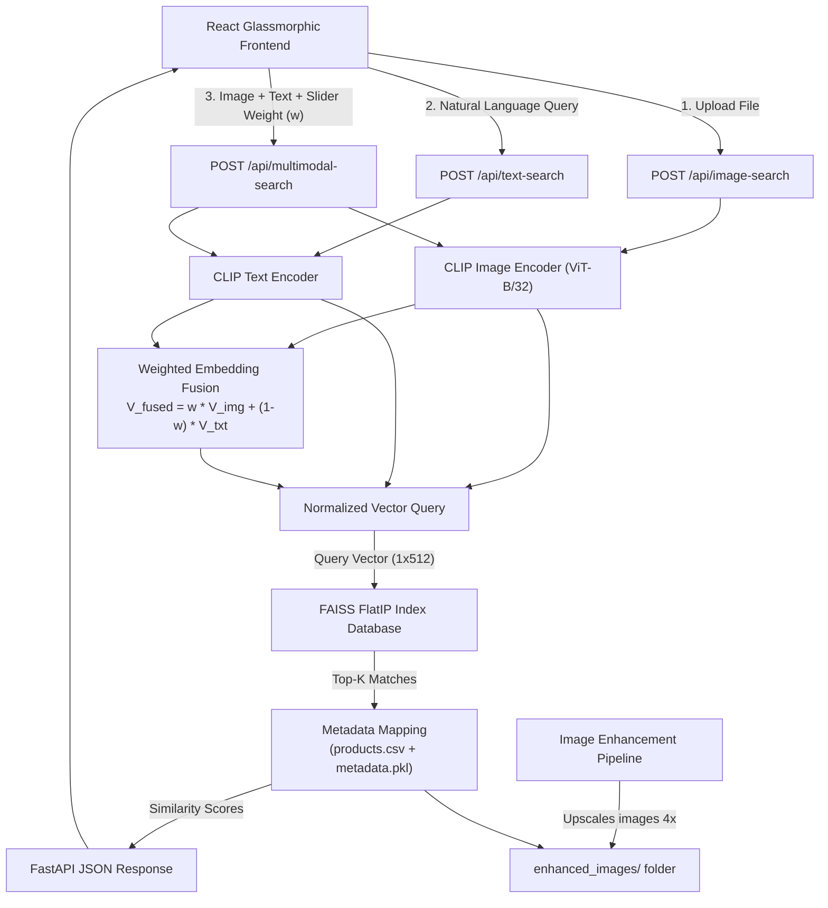
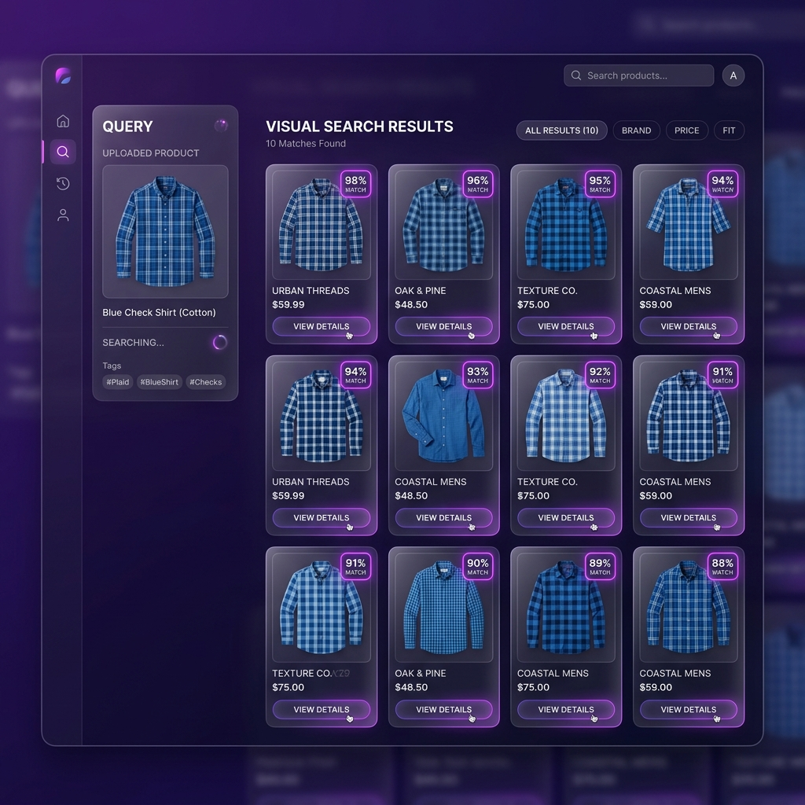
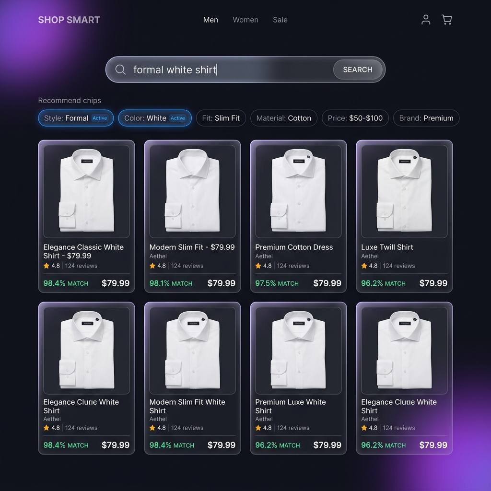
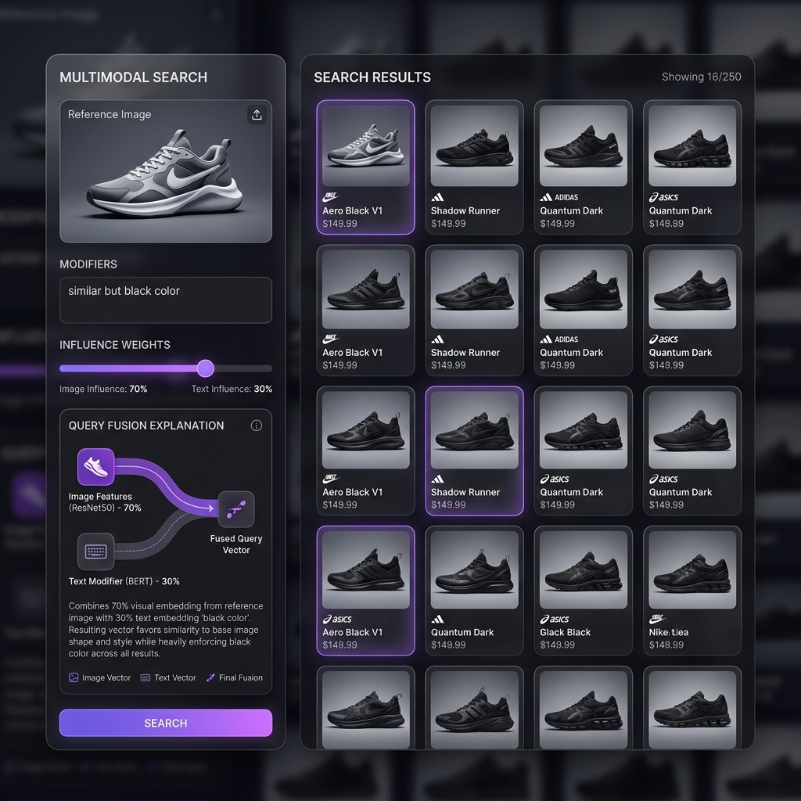

# NovaLens AI: Multimodal Product Discovery Platform

NovaLens AI is a modern, premium, multimodal product discovery platform for e-commerce. It enables customers to find products via visual similarities, semantic natural language, or a hybrid combination of both using state-of-the-art vector embeddings and similarity search index models.

---

## 1. Project Overview & Features
* **Visual Search (Phase 1)**: Drag and drop reference images to perform instantaneous visual searches.
* **Semantic Text Search (Phase 2)**: Query the catalog using natural language (e.g., `"formal white shirt"`, `"black leather boots"`) leveraging CLIP's aligned text-to-image vector space.
* **Multimodal Search (Phase 3)**: Mix visual input with text modifiers (e.g., upload a red shirt, type `"similar but black color"`) and control their influence using an interactive weight slider.
* **Query Explainability**: Real-time explanation panel detailing weights, influences, and the fusion mathematical process.
* **Search History Sidebar**: Stays persisted in the browser local storage, keeping the latest 10 query states (including base64 visual backups) to easily restore inputs and reload results.
* **4x Resolution Enhancement**: Fallback cascading image enhancement upscaling pipeline to convert 60x80 icons to high-definition 240x320 assets.

---

## 2. Architecture Diagram



---

## 3. Technology Stack
* **Frontend**: React (Vite), TailwindCSS, Axios, Lucide Icons
* **Backend**: FastAPI (Python), Uvicorn ASGI Server
* **ML Embeddings**: OpenAI CLIP (`ViT-B/32` model)
* **Vector Index**: FAISS (Facebook AI Similarity Search - IndexFlatIP)
* **Image Upscaling**: Real-ESRGAN (`RealESRGAN_x4plus`), OpenCV DNN Super Resolution (`FSRCNN`), OpenCV Lanczos4 Resampling
* **Data Processing**: Pandas, NumPy, Pillow (PIL)

---

## 4. UI Demonstrations & Screenshots

### A. Image Similarity Search
*Drag-and-drop a visual catalog reference to fetch matching silhouettes and cuts:*


### B. Semantic Text Search
*Leverage natural language semantics instead of standard keyword matching:*


### C. Multimodal Search & Explainability
*Fuses a visual target with written instructions, accompanied by the Query Explanation panel:*


---

## 5. Installation & Setup Guide

### Step 1: Clone & Install Dependencies
1. **Clone the repository** and navigate to the root directory.
2. **Install Python backend requirements**:
   ```bash
   pip install -r requirements.txt
   ```
   *(This installs PyTorch, torchvision, fastapi, uvicorn, faiss, realesrgan, opencv-contrib-python, and the CLIP wheel).*
3. **Install React frontend requirements**:
   ```bash
   cd frontend
   npm install
   cd ..
   ```

### Step 2: Dataset Preparation
Ensure the Fashion dataset is located inside `data/fashion/images/` and `data/fashion/styles.csv` is present.
1. Run the validation and pricing generation script:
   ```bash
   python data/prepare_dataset.py
   ```
   *(This sanitizes IDs, generates synthetic price points, and creates `data/products.csv`).*
2. **Upscale catalog images (Optional)**:
   To upscale standard 60x80 images to high-definition:
   ```bash
   # Upscale a test batch of 1000 images
   python data/image_enhancement/upscale_images.py --limit 1000
   
   # Upscale the entire catalog
   python data/image_enhancement/upscale_images.py --all
   ```

### Step 3: Rebuild Vector Index
To compile image embeddings and serialize FAISS metadata:
```bash
python vector_store/build_image_index.py --limit 5000
```
*To index the entire 44,000+ fashion catalog, pass `--limit -1`:*
```bash
python vector_store/build_image_index.py --limit -1
```

### Step 4: Run Application Servers
1. **Launch FastAPI Backend** (from the root directory):
   ```bash
   uvicorn backend.main:app --host 127.0.0.1 --port 8000
   ```
2. **Launch React Frontend** (from `frontend/` directory):
   ```bash
   cd frontend
   npm run dev
   ```
3. Open your browser and navigate to [http://localhost:5173](http://localhost:5173).

---

## 6. Testing Guide
Run backend pipeline tests and endpoint client validations locally:
```bash
# Verify CLIP and offline FAISS pipeline
python test_backend.py

# Verify endpoint HTTP responses
python test_endpoint.py

# Run complete integration test suite
python -m unittest tests/test_text_search.py tests/test_multimodal_search.py
```

---

## 7. Troubleshooting & FAQS

#### Q: The endpoints fail with `Search index database files are missing`?
**A**: This indicates the FAISS index database has not been initialized. Execute `python vector_store/build_image_index.py` from the root directory to generate the index and metadata mapping files.

#### Q: Backend crashes with CUDA Out of Memory (OOM) errors?
**A**: CLIPLoader automatically checks if a CUDA-compatible GPU is present and falls back to CPU if unavailable. If you hit OOM issues on low-end GPUs, force CPU mode by modifying the initialization device inside [clip_loader.py](file:///c:/Users/nehas/.gemini/antigravity-ide/scratch/NovaLens-AI/ml/clip/clip_loader.py) to `"cpu"`.

#### Q: Low-resolution images are blurry on product cards?
**A**: Execute the upscaling pipeline `python data/image_enhancement/upscale_images.py --limit 1000`. Once finished, rebuild the vector index (`python vector_store/build_image_index.py`) and restart the FastAPI server to update paths.
